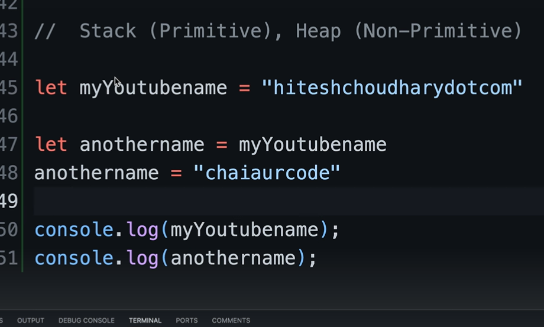
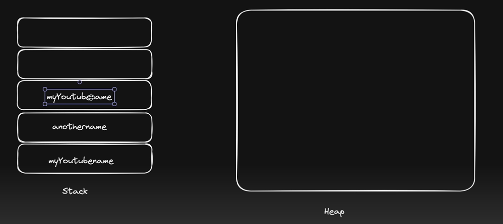
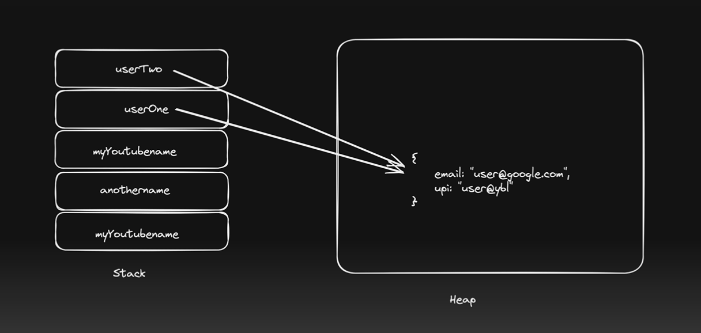
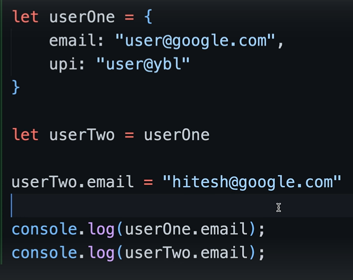
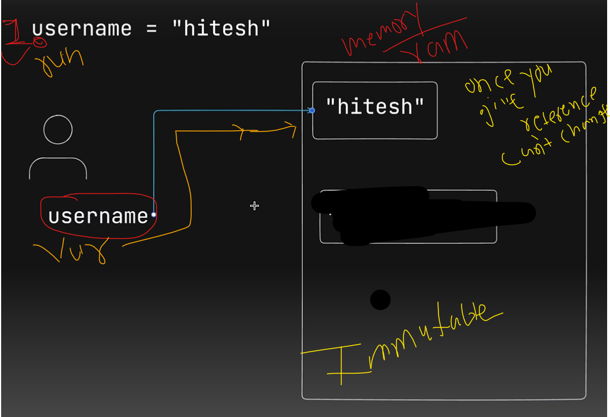
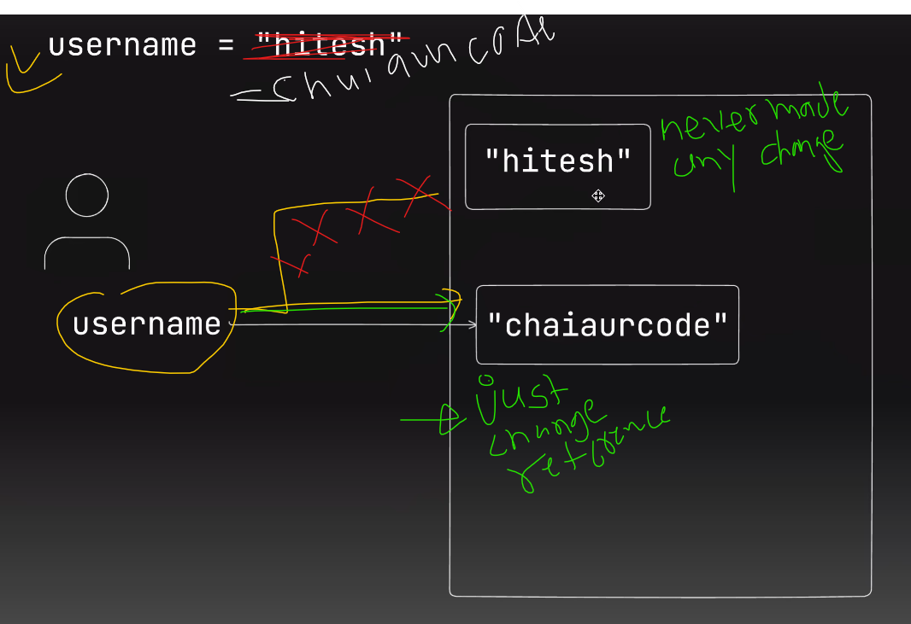
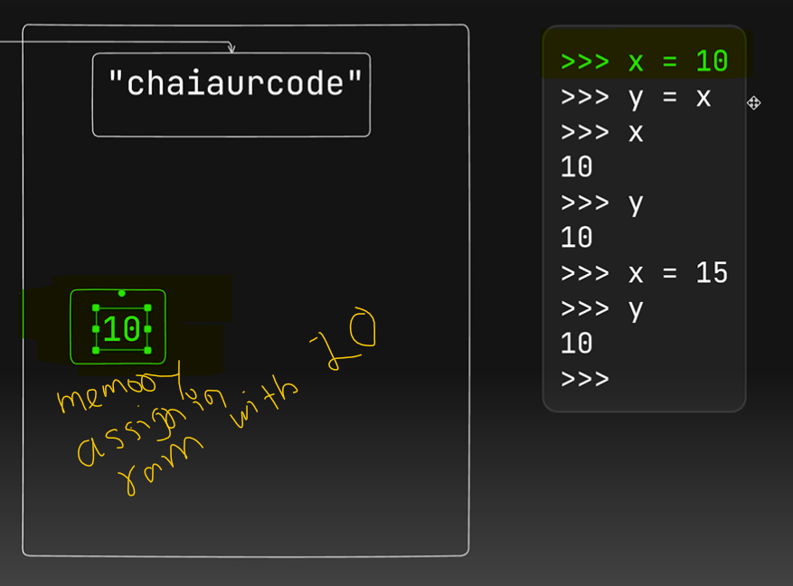
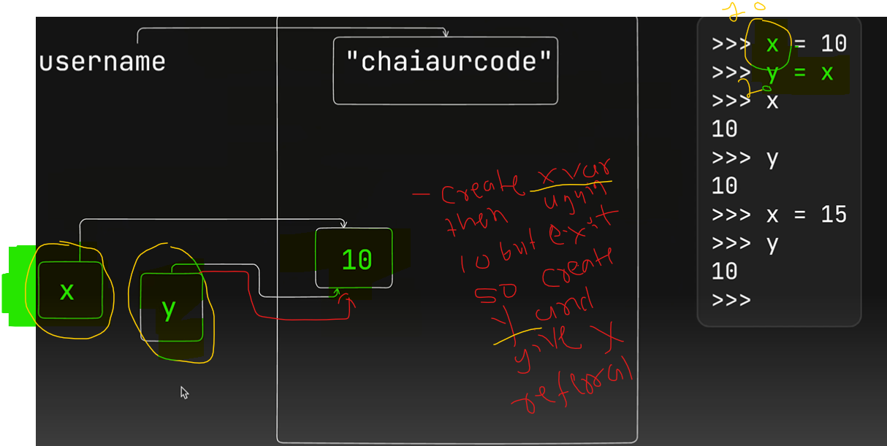
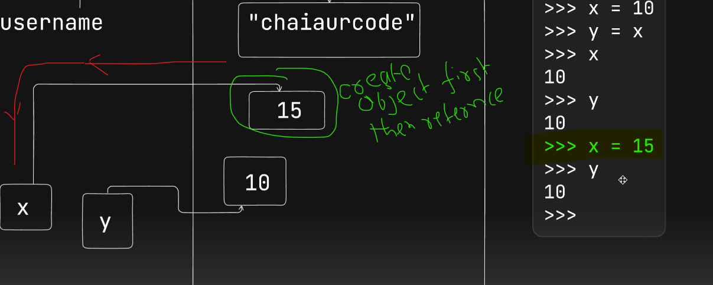
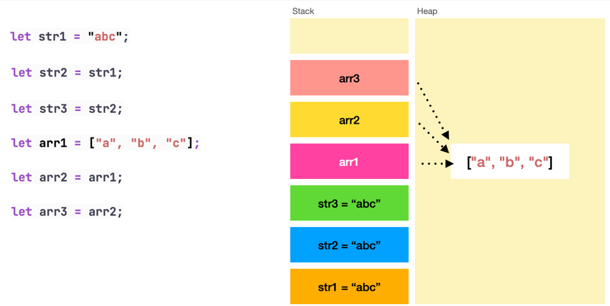

https://www.youtube.com/watch?v=7gwc-1czolw&list=PLu71SKxNbfoBuX3f4EOACle2y-tRC5Q37&index=11

//primitive (stack)  - string, number, 
//non primitive (heap) - array, object 

> 
> 
> In primitive when we declare variable we get a copy 

> 
> 
> where, in non-primitive we get reference of original value, so if you make any change that will affect referee too,

//---------------------------------
python internal working // mutuable and immutable
> in python create everything in ram/memory is object

> now changing the value,  username = "chaiaurcode"

here, just changing the reference we never edited/deleted "hitesh" data. after short time that will collect and deleted by garbage collection.

-----------------------------------------------

<h1>Second</h1>

> first memory will assign in the ram/memory
    - like step1, 
    - liek step2, 

> x= 15. So x would change not y

>   
